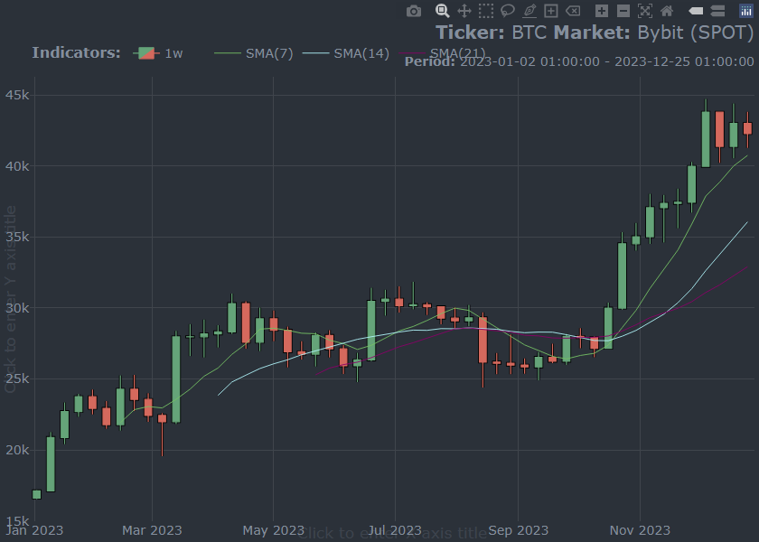
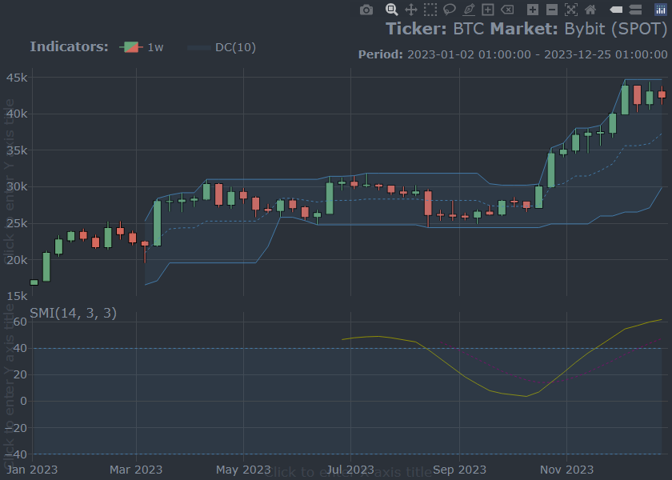

<!-- NEWS.md is generated from NEWS.Rmd. Please edit that file -->

# cryptoQuotes (Development version)

## General

## Improvements

### Supported Exchanges (Issue [\#14](https://github.com/serkor1/cryptoQuotes/issues/14))

{cryptoQuotes} now supports the following exchanges:

- Crypto.com
- Huobi
- MEXC

## Breaking Changes

## Bugfixes

- Fixed a bug in the `chart()`-function where a warning would be given
  if called using namespace qualified function calls (Issue
  [\#13](https://github.com/serkor1/cryptoQuotes/issues/13))
- Fixed a bug in the `chart()`-function where a `legend` wouldn’t show
  unless a main-chart indicator were included. (Issue
  [\#13](https://github.com/serkor1/cryptoQuotes/issues/13))

# cryptoQuotes 1.3.1

## General

> **NOTE:** With this update the package is no longer considered
> `experimental`.

- Removed deprecated functions `getQuote()`-, `getFGIndex()`- and
  `getLSRatio()`-functions.

- Removed decprecated functions `availableExchanges()`-,
  `availableIntervals()`- and `availableTickers()`-functions.

These functions were planned to be deleted in `1.4.0` - however, we have
decided to aim for an `JOSS`- and `rOpenSci`-subscription which requires
some degree of stability. Hence the deletion of these function at
`1.3.0`.

We expect `1.4.0` to be released *after* `rOpenSci`-submission and
acceptance :pray:

## Improvements

### New features

- `smi()`-function, a `subchart`-indicator built on the
  `TTR::SMI()`-function.
- `donchian_channel()`-function, a `main chart`-indicator built on the
  `TTR::DonchianChannel()`-function

<details>
<summary>
Usage
</summary>

``` r
chart(
  ticker = BTC,
  main   = kline(),
  indicator = list(
    donchian_channel()
  ),
  sub = list(
    smi()
  )
)
```


</details>

### Expanded Support

- `get_openinterest()` is now supported by `kraken`

<details>
<summary>
Usage
</summary>

``` r
tail(
  get_openinterest(
    ticker   = "PF_XBTUSD",
    interval = "1h",
    source   = "kraken"
  )
)
```

    #>                     open_interest
    #> 2024-06-25 15:00:00      2352.477
    #> 2024-06-25 16:00:00      2449.550
    #> 2024-06-25 17:00:00      2410.773
    #> 2024-06-25 18:00:00      2375.286
    #> 2024-06-25 19:00:00      2330.929
    #> 2024-06-25 20:00:00      2327.498

</details>

### Charting

- The `chart()`-function now has proper `light`-theme available that
  isn’t the default `plotly`-values.
- The charts now displays date ranges as a subtitles.
- The `bollinger_bands()`-function now accepts a `color`-argument. These
  can be passed as `Hexadecimal`-colors or as is, `"blue"` for example.
- A new main chart function has been introduced. `pline()` which is a
  univariate price chart based on either open, high, low or close
  prices.

<details>
<summary>
Usage
</summary>

``` r
chart(
  ticker = BTC,
  main   = pline(price = "close"),
  indicator = list(
    bollinger_bands(
    color = "steelblue"
  )
  ),
  sub = list(
    volume()
  ),
  options = list(
    dark = FALSE
  )
)
```


</details>

### Documentation

- The documentation has been extensively reworked. This is includes, but
  not limited to, sample outputs for all `get_*`-functions.

### Backend Changes

- The `chart()`-functions no longer depend on `rlang`.

> **Note:** we are generally moving away from `rlang`, `purrr` and
> `tidyverse` in general. We are, however, keeping the `tidyverse`
> styleguide.

- Removed dependency on `conflicted`-package.

Prior to version `1.3.0` the `get*`-functions were following the syntax
of `quantmod` closely, and this goes for the function naming too. With
the adoption of the `tidyverse` style guide, there is no conflicts that
needs to be resolved on `stable`- and `experimental`-functions.

### New developper tools

- `pull()`-function
- `var_ly()`-function
- `build()`-function

## Breaking Changes

- The `get_fgindex()`-function now returns columns in lower case.

## Bugfixes

- Fixed a bug where `get_fgindex()` where labelled as `deprecated`
- Fixed a bug in the `limitations`-article where the desired number of
  observations werent compatible with the `kraken`-exchange.
- Fixed a warning in the `get_lsratio()`-function with
  `source = "binance"`
- Fixed a bug in the `lsr()`-indicator which broke the
  `chart()`-function when included.
- Fixed a bug in the `get_quote()`-function where if `to = NULL` and
  `from != NULL` the returned `quote` would be filtered according to
  `UTC` and not `Sys.timezone()`
- Fixed a bug in the `chart()`-function where the inferred intervals
  would be incorrect for leap years, and months different from 30 days.

# cryptoQuotes 1.3.0

## Improvements

### General function improvements

- `get_lsratio` and `getLSratio()` supports `kraken` and `bybit` as
  `source`

- `available_`-functions are more adaptive to the calling environments

``` r
## charting the klines
## with indicators as
## subcharts
available_exchanges(type = 'ohlc')
```

Now returns all available exhanges that supports Open, High, Low and
Close market data. The `type`-argument can be changed to, for example,
`lsratio` to get all available exchanges that supports Long to Shorts
ratios. Similar changes have been made to remaining
`available_`-functions.

### Error-handling

All `get_*`- and `available_*`-functions are now more robust to API and
input errors.

### Default Returning

- `quotes` and `fear and greed index` now returns `200` rows instead of
  `100`

### Charting

- The `charts` now has a `dark` and `light` theme. Its passed into the
  `options = list(dark = TRUE)` of the `chart()`-function.
- The `charts` are now more color deficiency compliant, and the
  `deficiency` parameter in `options = list(deficiency = TRUE)` now
  applies to all `chart`-elements
- The `charts` are now constructed without `%>%` and, should, be more
  intuitive to navigate in. See example below,

``` r
## charting the klines
## with indicators as
## subcharts
chart(
  ticker     = BTC,
  main       = kline(),
  sub        = list(
    volume()
  ),
  indicator = list(
    bollinger_bands(),
    sma(),
    alma()
  ),
  options = list(
    dark       = TRUE,
    deficiency = FALSE
  )
)
```


### Exchange Support

The following exchanges have been added to list of `exchanges`
available,

- ByBit

### New features

- Funding rates, `get_fundingrate()`

<details>
<summary>
Usage
</summary>

``` r
## get funding rate
tail(
  get_fundingrate(
    ticker = "BTCUSDT",
    source = "binance"
  )
)
```

    #>                     funding_rate
    #> 2024-06-24 02:00:00    9.534e-05
    #> 2024-06-24 10:00:00    1.000e-04
    #> 2024-06-24 18:00:00    7.488e-05
    #> 2024-06-25 02:00:00    7.447e-05
    #> 2024-06-25 10:00:00    5.949e-05
    #> 2024-06-25 18:00:00    7.752e-05

</details>

- Open interest, `get_openinterest()`

<details>
<summary>
Usage
</summary>

``` r
## get funding rate
tail(
  get_openinterest(
    ticker = "BTCUSDT",
    source = "binance"
  )
)
```

    #>                     open_interest
    #> 2024-06-20 02:00:00      75443.81
    #> 2024-06-21 02:00:00      74377.63
    #> 2024-06-22 02:00:00      76738.13
    #> 2024-06-23 02:00:00      78036.86
    #> 2024-06-24 02:00:00      77593.99
    #> 2024-06-25 02:00:00      76111.90

</details>

## Breaking Changes

### Charting

- All the `charting`-functions have been reworked without backwards
  compatibility, or `lifecycle::deprecated()`-warnings. The
  `charting`-functions were, and still is, in an `experimental`-stage.

### API Calls

- All `dates` passed to `get_*`-functions assumed the dates were given
  in `UTC`, and were retrieved as `UTC`. These have now been changed;
  all functions now uses `Sys.timezone()` as `default` upon request and
  retrieval.

## Warning

As the `cryptoQuotes`-package has moved to the `tidyverse` style guide,
the `getFoo`-functions are now `deprecated`. These will be permanently
deleted, and removed from the `cryptoQuotes`-package, at version 1.4.0!

# cryptoQuotes 1.2.1

### Minor Updates

- Added DOGECOIN data. This data is extracted on the `1m` chart, around
  Elon Musks Tweet.
- Added a usecase in the Vignette about Dogecoin and Elon Musk to
  showcase the functionality of the library.

### Bugfixes

- Corrected misspelled ticker in Vignette
- All returned Quotes are now in `UTC`, again.
- Fixed an error on the `Bitmart` API where weekly candles would throw
  an error.

# cryptoQuotes 1.2.0

- All `from` and `to` arguments are now more flexible, and supports
  passing `Sys.Date()` and `Sys.time()` directly into the
  `get`-functions.

- `getQuote()` now returns up to 100 pips preceding the specified `to`
  date, when `from = NULL`. It returns 100 pips, or up to `Sys.Date()`,
  from the specified `from` date.

The `getQuote()`-function can now be used as follows;

    ## Specifying from
    ## date only;
    ##
    ## Returns 10 pips
    getQuote(
     ticker   = 'BTCUSDT',
     interval = '1d'
     from     = as.character(Sys.Date() - 10)
     )

    ## Specifying to
    ## date only;
    ##
    ## Returns 100 pips
    getQuote(
     ticker   = 'BTCUSDT',
     interval = '1d'
     to     = as.character(Sys.Date())
     )

## Market Sentiment

Four new functions are added,

- `getFGIndex()` which returns the daily Fear and Greed Index.
- `addFGIndex()` which adds the Fear and Greed Index as a subplot to
  price charts.
- `getLSRatio()` which returns the long-short ratio with varying
  granularity. Contributor has been credited.
- `addLSRatio()` which adds the long-short ratio as a subplot to price
  charts.

## Convinience functions added

Three new convinience functions are added applicable to some situations,

- `removeBound()`
- `splitWindow()`
- `calibrateWindow()`

# cryptoQuotes 1.1.0

## Frontend

`getQuote()` now returns up to 100 pips when `to` and `from` is `NULL`

## Backend

- All code has been rewritten so its compatible with `httr2`, the
  package used `httr` at version `1.0.0`.

## Future releases

In the next release, three more exchanges will be supported.

## Known bugs

The returned `quotes` are in local timezone, this is an unintentional
feature and will be fixed in a bugfix.

# cryptoQuotes 1.0.0

- Initial CRAN submission :rocket:
