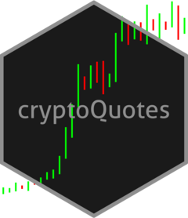

<!-- README.md is generated from README.Rmd. Please edit that file -->

## cryptoQuotes <a href="https://serkor1.github.io/cryptoQuotes/"></a>

<!-- badges: start -->

[](https://lifecycle.r-lib.org/articles/stages.html#experimental)
[](https://github.com/serkor1/cryptoQuotes/actions/workflows/R-CMD-check.yaml)
[](https://app.codecov.io/gh/serkor1/cryptoQuotes?branch=main)
<!-- badges: end -->

The cryptoQuotes package is an unified REST API access to public market
data from all major cryptocurrency exchanges. The package is compatible
with `quantmod` and `TTR` out of the box.

#### Supported Exchanges and Markets

Currently, cryptoQuotes supports perpetual futures and spot markets on
the following exchanges; `binance`, `kucoin` and `kraken`. More
exchanges will be added in the future.

> **Note:** cryptoQuotes supports various intervals limited to what the
> different exchange APIs allows. The lowest interval is 1s (Seconds),
> and the highest is 1M (Months)

#### Basic usage

Get USDT denominated ATOM in the spot market from Binance in `30m`
intervals,

``` r
## get perpetual contracts on USDT denominated ATOM
spotPrice <- cryptoQuotes::getQuote(
  ticker = 'ATOMUSDT',
  source = 'binance',
  futures = FALSE,
  interval = '30m'
)
```

#### Installation

**Stable Version**

``` r
devtools::install_github(
  repo = 'https://github.com/serkor1/cryptoQuotes/',
  ref = 'main'
)
```

**Development Version**

``` r
devtools::install_github(
  repo = 'https://github.com/serkor1/cryptoQuotes/',
  ref = 'development'
)
```
