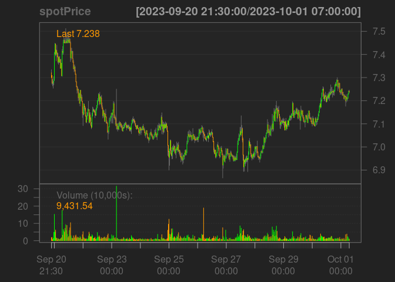

<!-- README.md is generated from README.Rmd. Please edit that file -->

# cryptoQuotes

<!-- badges: start -->
<!-- badges: end -->

The goal of cryptoQuotes is to create a unified API access to all known
major cryptocurrency exchanges, and preserving the compatibility with
libraries such as `quantmod` and `TTR`.

## Installation

You can install the development version of cryptoQuotes like so:

``` r
devtools::install_github(
  repo = 'https://github.com/serkor1/cryptoQuotes/',
  ref = 'development'
)
```

## Example

To get the latest prices on a desired cryptocurrency pair,

``` r
## get spotprice on USDT denominated ATOM
spotPrice <- cryptoQuotes::getQuote(
  ticker = 'ATOMUSDT',
  source = 'binance',
  futures = FALSE,
  interval = '30m'
)
```

This `spotPrice` can be passed to the `chartSeries` from `quantmod`
directly to chart it with candlesticks.

``` r
## chart the spotPrice series
## using quantmod
quantmod::chartSeries(
  x = spotPrice,
  theme = quantmod::chartTheme('black')
)
```

 When the
`spotPrice` has been charted, the indicators in `quantmod` is directly
applicable. See for example `addBBands`

``` r
## add bollinger bands 
## using quantmod
quantmod::addBBands()
```


