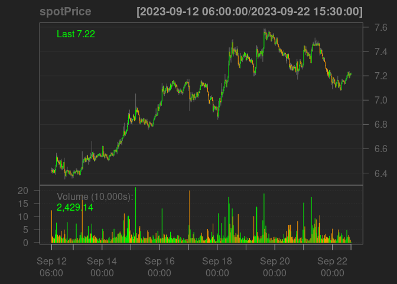
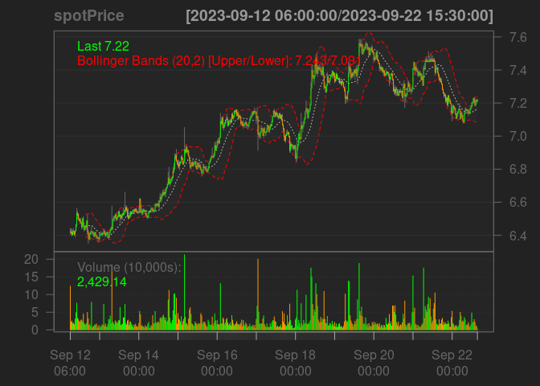
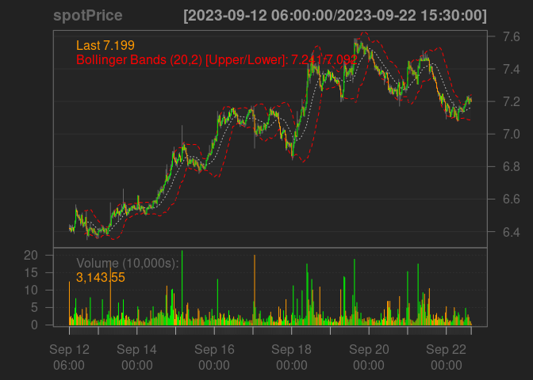

<!-- README.md is generated from README.Rmd. Please edit that file -->

# cryptoQuotes

<!-- badges: start -->
<!-- badges: end -->

The goal of cryptoQuotes is to …

## Installation

You can install the development version of cryptoQuotes like so:

``` r
# FILL THIS IN! HOW CAN PEOPLE INSTALL YOUR DEV PACKAGE?
```

## Example

This is a basic example which shows you how to solve a common problem:

``` r
library(cryptoQuotes)
## basic example code
spotPrice <- getQuote(
  ticker = 'ATOMUSDT',
  source = 'binance',
  futures = FALSE,
  interval = '30m'
)
```

What is special about using `README.Rmd` instead of just `README.md`?
You can include R chunks like so:

``` r
quantmod::chartSeries(
  x = spotPrice,
  theme = quantmod::chartTheme('black')
)
#> Registered S3 method overwritten by 'quantmod':
#>   method            from
#>   as.zoo.data.frame zoo
```



``` r
quantmod::addBBands()
```



You’ll still need to render `README.Rmd` regularly, to keep `README.md`
up-to-date. `devtools::build_readme()` is handy for this.

You can also embed plots, for example:



In that case, don’t forget to commit and push the resulting figure
files, so they display on GitHub and CRAN.
