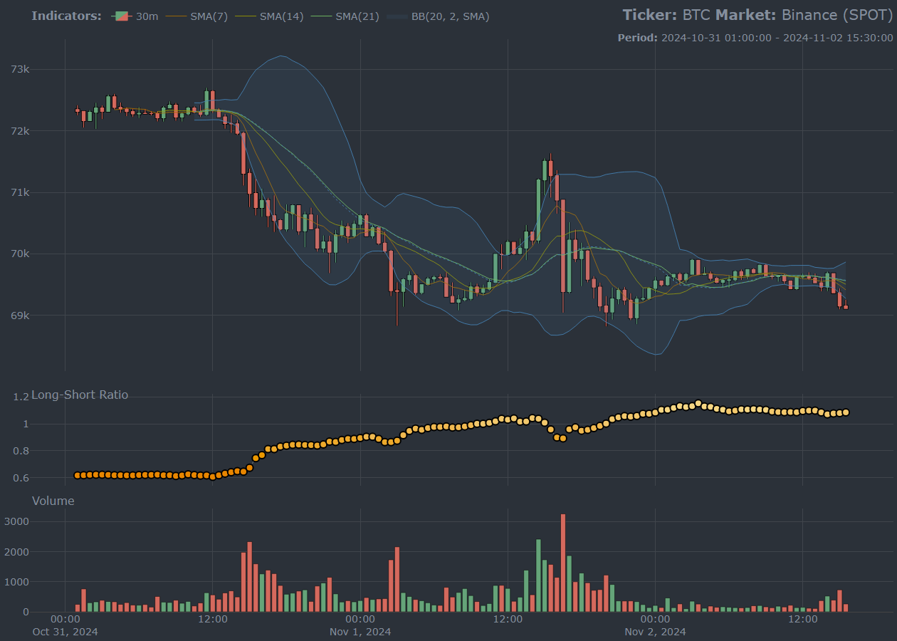

<!-- README.md is generated from README.Rmd. Please edit that file -->

# cryptoQuotes: A streamlined access to OHLC-V market data and sentiment indicators in R <a href="https://serkor1.github.io/cryptoQuotes/"></a>

<!-- badges: start -->

[](https://CRAN.R-project.org/package=cryptoQuotes)
[](https://r-pkg.org/pkg/cryptoQuotes)
[](https://github.com/serkor1/cryptoQuotes/actions/workflows/R-CMD-check.yaml)
[](https://codecov.io/gh/serkor1/cryptoQuotes)
[](https://lifecycle.r-lib.org/articles/stages.html#experimental)
<!-- badges: end -->

## :information_source: Overview

The `cryptoQuotes`-package is a high-level API-client to get current,
and historical, cryptocurrency OHLC-V market and sentiment data in `R`,
without using web-crawlers or API keys. This `R`-package uses `xts` and
`zoo` under the hood and are compatible with `quantmod` and `TTR` out of
the box.

### Supported exchanges and markets

All supported exchanges and markets are listed in the table below,
alongside the available range of intervals available from the respective
exchanges,

<div align="center">

<table style="width:100%; color: black; margin-left: auto; margin-right: auto;" class="table">
<caption>
Supported exchanges, markets and intervals.
</caption>
<thead>
<tr>
<th style="text-align:left;">
Exchange
</th>
<th style="text-align:center;">
Spot
</th>
<th style="text-align:center;">
Futures
</th>
<th style="text-align:center;">
Available Intervals
</th>
<th style="text-align:center;">
Smallest Interval
</th>
<th style="text-align:center;">
Biggest Interval
</th>
</tr>
</thead>
<tbody>
<tr>
<td style="text-align:left;">
Binance
</td>
<td style="text-align:center;">
✔
</td>
<td style="text-align:center;">
✔
</td>
<td style="text-align:center;">
16
</td>
<td style="text-align:center;">
1 second(s)
</td>
<td style="text-align:center;">
1 month(s)
</td>
</tr>
<tr>
<td style="text-align:left;">
Bitmart
</td>
<td style="text-align:center;">
✔
</td>
<td style="text-align:center;">
✔
</td>
<td style="text-align:center;">
13
</td>
<td style="text-align:center;">
1 minute(s)
</td>
<td style="text-align:center;">
1 week(s)
</td>
</tr>
<tr>
<td style="text-align:left;">
Bybit
</td>
<td style="text-align:center;">
✔
</td>
<td style="text-align:center;">
✔
</td>
<td style="text-align:center;">
13
</td>
<td style="text-align:center;">
1 minute(s)
</td>
<td style="text-align:center;">
1 month(s)
</td>
</tr>
<tr>
<td style="text-align:left;">
Kraken
</td>
<td style="text-align:center;">
✔
</td>
<td style="text-align:center;">
✔
</td>
<td style="text-align:center;">
10
</td>
<td style="text-align:center;">
1 minute(s)
</td>
<td style="text-align:center;">
2 week(s)
</td>
</tr>
<tr>
<td style="text-align:left;">
Kucoin
</td>
<td style="text-align:center;">
✔
</td>
<td style="text-align:center;">
✔
</td>
<td style="text-align:center;">
13
</td>
<td style="text-align:center;">
1 minute(s)
</td>
<td style="text-align:center;">
1 week(s)
</td>
</tr>
</tbody>
</table>

</div>

### :information_source: Basic Usage

#### OHLC-V Market Data

Get USDT denominated Bitcoin spot market price from Binance with
`30m`-intervals using the `get_quote()`-function,

``` r
## BTC OHLC prices
## from Binance spot market
## in 30 minute intervals
BTC <- cryptoQuotes::get_quote(
  ticker = 'BTCUSDT',
  source = 'binance',
  futures = FALSE,
  interval = '30m',
  from    = Sys.Date() - 1 
)
```

<div align="center">

<table style="width:100%; color: black; margin-left: auto; margin-right: auto;" class="table">
<caption>
Bitcoin (BTC) OHLC-prices
</caption>
<thead>
<tr>
<th style="text-align:left;">
index
</th>
<th style="text-align:center;">
open
</th>
<th style="text-align:center;">
high
</th>
<th style="text-align:center;">
low
</th>
<th style="text-align:center;">
close
</th>
<th style="text-align:left;">
volume
</th>
</tr>
</thead>
<tbody>
<tr>
<td style="text-align:left;">
2024-05-17 15:00:00
</td>
<td style="text-align:center;">
66379.97
</td>
<td style="text-align:center;">
66458.63
</td>
<td style="text-align:center;">
66155.12
</td>
<td style="text-align:center;">
66333.16
</td>
<td style="text-align:left;">
541.84776
</td>
</tr>
<tr>
<td style="text-align:left;">
2024-05-17 15:30:00
</td>
<td style="text-align:center;">
66333.15
</td>
<td style="text-align:center;">
66393.59
</td>
<td style="text-align:center;">
65828.03
</td>
<td style="text-align:center;">
65944.02
</td>
<td style="text-align:left;">
788.85641
</td>
</tr>
<tr>
<td style="text-align:left;">
2024-05-17 16:00:00
</td>
<td style="text-align:center;">
65944.02
</td>
<td style="text-align:center;">
66422.31
</td>
<td style="text-align:center;">
65914.81
</td>
<td style="text-align:center;">
66348.05
</td>
<td style="text-align:left;">
559.0893
</td>
</tr>
<tr>
<td style="text-align:left;">
2024-05-17 16:30:00
</td>
<td style="text-align:center;">
66348.04
</td>
<td style="text-align:center;">
66850
</td>
<td style="text-align:center;">
66281.27
</td>
<td style="text-align:center;">
66806.66
</td>
<td style="text-align:left;">
1035.00651
</td>
</tr>
<tr>
<td style="text-align:left;">
2024-05-17 17:00:00
</td>
<td style="text-align:center;">
66806.67
</td>
<td style="text-align:center;">
67404.22
</td>
<td style="text-align:center;">
66552.53
</td>
<td style="text-align:center;">
67392.01
</td>
<td style="text-align:left;">
2386.36993
</td>
</tr>
<tr>
<td style="text-align:left;">
2024-05-17 17:30:00
</td>
<td style="text-align:center;">
67392.01
</td>
<td style="text-align:center;">
67451.2
</td>
<td style="text-align:center;">
67033.83
</td>
<td style="text-align:center;">
67195.1
</td>
<td style="text-align:left;">
1411.25731
</td>
</tr>
</tbody>
</table>

</div>

#### Charting OHLC-V

The `BTC`-object can be charted using the `chart()`-function,

``` r
## Chart BTC
## using klines, SMA, 
## MACD and Bollinger Bands
cryptoQuotes::chart(
  ticker = BTC,
  main   = cryptoQuotes::kline(),
  sub    = list(
    cryptoQuotes::volume(),
    cryptoQuotes::macd()
  ),
  indicator = list(
    cryptoQuotes::sma(n = 7),
    cryptoQuotes::sma(n = 14),
    cryptoQuotes::sma(n = 21),
    cryptoQuotes::bollinger_bands()
  )
)
```



## :information_source: Installation

### Stable version

``` r
# install from CRAN
install.packages(
  pkgs = 'cryptoQuotes',
  dependencies = TRUE
)
```

### Development version

``` r
# install from github
devtools::install_github(
  repo = 'https://github.com/serkor1/cryptoQuotes/',
  ref  = 'development'
)
```

## :warning: Disclaimer

This `library` is still considered `experimental` but no breaking
changes will be made on functions labelled as `stable` without
appropriate action; please refer to the [release notes](NEWS.md), or
submit an [issue](https://github.com/serkor1/cryptoQuotes/issues) if
that promise is broken.

## :information_source: Code of Conduct

Please note that the `cryptoQuotes` project is released with a
[Contributor Code of
Conduct](https://serkor1.github.io/cryptoQuotes/CODE_OF_CONDUCT.html).
By contributing to this project, you agree to abide by its terms.
