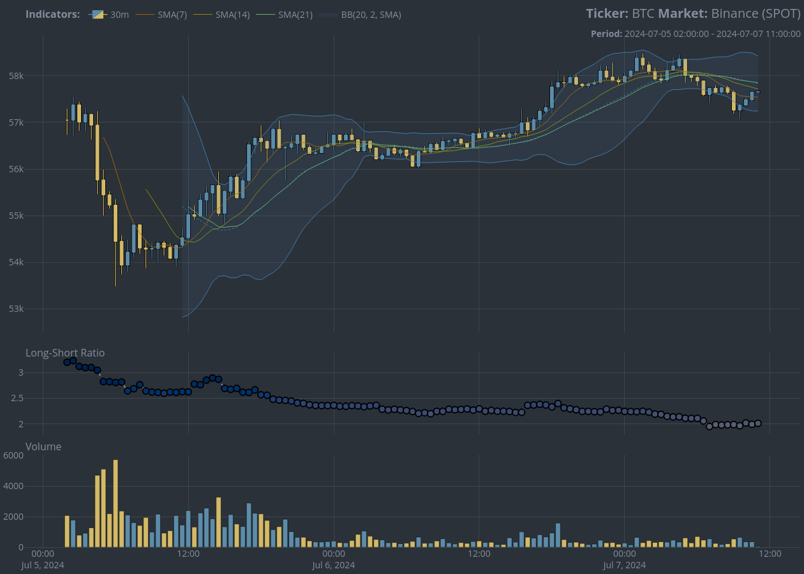

<!-- README.md is generated from README.Rmd. Please edit that file -->

# {cryptoQuotes}: Open access to cryptocurrency market data <a href="https://serkor1.github.io/cryptoQuotes/"></a>

<!-- badges: start -->

[](https://CRAN.R-project.org/package=cryptoQuotes)
[](https://r-pkg.org/pkg/cryptoQuotes)
[](https://github.com/serkor1/cryptoQuotes/actions/workflows/R-CMD-check.yaml)
[](https://app.codecov.io/gh/serkor1/cryptoQuotes)
[](https://lifecycle.r-lib.org/articles/stages.html#stable)

<!-- badges: end -->

## :information_source: About

[{cryptoQuotes}](https://serkor1.github.io/cryptoQuotes/) is a
high-level API client for accessing public market data endpoints on
major cryptocurrency exchanges. It supports open, high, low, close and
volume (OHLC-V) data and a variety of sentiment indicators; the market
data is high quality and can be retrieved in intervals ranging from
*seconds* to *months*. All the market data is accessed and processed
without relying on crawlers, or API keys, ensuring an open, and
reliable, access for researchers, traders and students alike. There are
currently 8 supported cryptocurrency exchanges,

<div align="center">

<table style="width:100%; color: black; margin-left: auto; margin-right: auto;" class="table">
<caption>
Supported exchanges
</caption>
<tbody>
<tr>
<td style="text-align:center;">
binance
</td>
<td style="text-align:center;">
bitmart
</td>
<td style="text-align:center;">
bybit
</td>
<td style="text-align:center;">
crypto.com
</td>
</tr>
<tr>
<td style="text-align:center;">
huobi
</td>
<td style="text-align:center;">
kraken
</td>
<td style="text-align:center;">
kucoin
</td>
<td style="text-align:center;">
mexc
</td>
</tr>
</tbody>
</table>

</div>

All data is returned as
[{xts}](https://github.com/joshuaulrich/xts)-objects which enables
seamless interaction with with
[{quantmod}](https://github.com/joshuaulrich/quantmod) and
[{TTR}](https://github.com/joshuaulrich/TTR), for developing and
evaluating trading strategies or general purpose cryptocurrency market
analysis with a historical or temporal perspective.

## :information_source: Overview

[{cryptoQuotes}](https://serkor1.github.io/cryptoQuotes/) has *two* main
features; retrieving cryptocurrency market data, and charting. The
market data consists of *OHLC-V* data and sentiment indicators;
including, but not limited to, cryptocurrency *fear and greed index*,
*long-short ratio* and *open interest*. All market data is retrieved
using the family of `get_*`-functions. To get a full overview of the
package and functionality please see the documentation via
[{pkgdown}](https://serkor1.github.io/cryptoQuotes/).

> \[!WARNING\]
>
> Given the nature of crypotcurrency data and general legislative
> restrictions, some `exchanges` may not work in your geolocation.

Below is a quick overview of the package and basic usage examples on
retrieving and charting Bitcoin (BTC) *OHLC-V* and *long-short ratio* in
30 minute intervals.

### :information_source: Cryptocurrency market data

#### OHLC-V

All supported exchanges and markets are listed in the table below,
alongside the available range of intervals available from the respective
exchanges,

<div align="center">

<table style="width:100%; color: black; margin-left: auto; margin-right: auto;" class="table">
<caption>
Supported exchanges, markets and intervals.
</caption>
<thead>
<tr>
<th style="text-align:left;">
Exchange
</th>
<th style="text-align:center;">
Spot
</th>
<th style="text-align:center;">
Futures
</th>
<th style="text-align:center;">
Available Intervals
</th>
<th style="text-align:center;">
Smallest Interval
</th>
<th style="text-align:center;">
Biggest Interval
</th>
</tr>
</thead>
<tbody>
<tr>
<td style="text-align:left;">
Binance
</td>
<td style="text-align:center;">
:white_check_mark:
</td>
<td style="text-align:center;">
:white_check_mark:
</td>
<td style="text-align:center;">
16
</td>
<td style="text-align:center;">
1 second(s)
</td>
<td style="text-align:center;">
1 month(s)
</td>
</tr>
<tr>
<td style="text-align:left;">
Bitmart
</td>
<td style="text-align:center;">
:white_check_mark:
</td>
<td style="text-align:center;">
:white_check_mark:
</td>
<td style="text-align:center;">
13
</td>
<td style="text-align:center;">
1 minute(s)
</td>
<td style="text-align:center;">
1 week(s)
</td>
</tr>
<tr>
<td style="text-align:left;">
Bybit
</td>
<td style="text-align:center;">
:white_check_mark:
</td>
<td style="text-align:center;">
:white_check_mark:
</td>
<td style="text-align:center;">
13
</td>
<td style="text-align:center;">
1 minute(s)
</td>
<td style="text-align:center;">
1 month(s)
</td>
</tr>
<tr>
<td style="text-align:left;">
Crypto.com
</td>
<td style="text-align:center;">
:white_check_mark:
</td>
<td style="text-align:center;">
:white_check_mark:
</td>
<td style="text-align:center;">
12
</td>
<td style="text-align:center;">
1 minute(s)
</td>
<td style="text-align:center;">
1 month(s)
</td>
</tr>
<tr>
<td style="text-align:left;">
Huobi
</td>
<td style="text-align:center;">
:white_check_mark:
</td>
<td style="text-align:center;">
:white_check_mark:
</td>
<td style="text-align:center;">
9
</td>
<td style="text-align:center;">
1 minute(s)
</td>
<td style="text-align:center;">
1 month(s)
</td>
</tr>
<tr>
<td style="text-align:left;">
Kraken
</td>
<td style="text-align:center;">
:white_check_mark:
</td>
<td style="text-align:center;">
:white_check_mark:
</td>
<td style="text-align:center;">
10
</td>
<td style="text-align:center;">
1 minute(s)
</td>
<td style="text-align:center;">
2 week(s)
</td>
</tr>
<tr>
<td style="text-align:left;">
Kucoin
</td>
<td style="text-align:center;">
:white_check_mark:
</td>
<td style="text-align:center;">
:white_check_mark:
</td>
<td style="text-align:center;">
13
</td>
<td style="text-align:center;">
1 minute(s)
</td>
<td style="text-align:center;">
1 week(s)
</td>
</tr>
<tr>
<td style="text-align:left;">
Mexc
</td>
<td style="text-align:center;">
:white_check_mark:
</td>
<td style="text-align:center;">
:white_check_mark:
</td>
<td style="text-align:center;">
10
</td>
<td style="text-align:center;">
1 minute(s)
</td>
<td style="text-align:center;">
1 month(s)
</td>
</tr>
</tbody>
</table>

</div>

<details>
<summary>
Example: Bitcoin OHLC-V
</summary>

Get USDT denominated Bitcoin (BTC) on the spot market from Binance in
`30m`-intervals using the `get_quote()`-function,

``` r
## BTC OHLC prices
## from Binance spot market
## in 30 minute intervals
BTC <- cryptoQuotes::get_quote(
  ticker   = 'BTCUSDT',
  source   = 'binance',
  futures  = FALSE,
  interval = '30m',
  from     = Sys.Date() - 1 
)
```

<div align="center">

<table style="width:100%; color: black; margin-left: auto; margin-right: auto;" class="table">
<caption>
Bitcoin (BTC) OHLC-V data
</caption>
<thead>
<tr>
<th style="text-align:left;">
index
</th>
<th style="text-align:center;">
open
</th>
<th style="text-align:center;">
high
</th>
<th style="text-align:center;">
low
</th>
<th style="text-align:center;">
close
</th>
<th style="text-align:left;">
volume
</th>
</tr>
</thead>
<tbody>
<tr>
<td style="text-align:left;">
2024-06-28 22:30:00
</td>
<td style="text-align:center;">
60286.02
</td>
<td style="text-align:center;">
60339.6
</td>
<td style="text-align:center;">
60209.15
</td>
<td style="text-align:center;">
60229.92
</td>
<td style="text-align:left;">
228.45504
</td>
</tr>
<tr>
<td style="text-align:left;">
2024-06-28 23:00:00
</td>
<td style="text-align:center;">
60229.92
</td>
<td style="text-align:center;">
60373.56
</td>
<td style="text-align:center;">
60132.83
</td>
<td style="text-align:center;">
60282.12
</td>
<td style="text-align:left;">
316.79215
</td>
</tr>
<tr>
<td style="text-align:left;">
2024-06-28 23:30:00
</td>
<td style="text-align:center;">
60282.12
</td>
<td style="text-align:center;">
60400
</td>
<td style="text-align:center;">
60270.05
</td>
<td style="text-align:center;">
60366.01
</td>
<td style="text-align:left;">
146.84163
</td>
</tr>
<tr>
<td style="text-align:left;">
2024-06-29
</td>
<td style="text-align:center;">
60366
</td>
<td style="text-align:center;">
60412.4
</td>
<td style="text-align:center;">
60305.01
</td>
<td style="text-align:center;">
60306.01
</td>
<td style="text-align:left;">
268.93211
</td>
</tr>
<tr>
<td style="text-align:left;">
2024-06-29 00:30:00
</td>
<td style="text-align:center;">
60306.01
</td>
<td style="text-align:center;">
60391.16
</td>
<td style="text-align:center;">
60293.88
</td>
<td style="text-align:center;">
60367.99
</td>
<td style="text-align:left;">
140.04982
</td>
</tr>
<tr>
<td style="text-align:left;">
2024-06-29 01:00:00
</td>
<td style="text-align:center;">
60367.99
</td>
<td style="text-align:center;">
60427.97
</td>
<td style="text-align:center;">
60360
</td>
<td style="text-align:center;">
60420
</td>
<td style="text-align:left;">
82.08988
</td>
</tr>
</tbody>
</table>

</div>

------------------------------------------------------------------------

</details>

#### Sentiment indicators

The sentiment indicators available in
[{cryptoQuotes}](https://serkor1.github.io/cryptoQuotes/) can be divided
in two; *derived indicators* and *market indicators*. The former is
calculated based on, for example, the price actions such as the *Moving
Average Convergence Divergence* (MACD) indicator. The latter are public
indicators such as the *long-short ratio* or *fear and greed index*;
these are retrieved using the family of `get_*`-functions, while the
derived indicators can be created using, for example,
[{TTR}](https://github.com/joshuaulrich/TTR).

In this overview we are focusing on *market indicators* made public by
the cryptocurrency exchanges. For a full overview of sentiment
indicators please refer to the documentation via
[{pkgdown}](https://serkor1.github.io/cryptoQuotes/). All supported
*market indicators* by exchange are listed in the table below,

<div align="center">

<table class="table" style="color: black; margin-left: auto; margin-right: auto;">
<caption>
Available sentiment indicators by exchange
</caption>
<thead>
<tr>
<th style="text-align:left;">
Endpoint
</th>
<th style="text-align:center;">
Binance
</th>
<th style="text-align:center;">
Bitmart
</th>
<th style="text-align:center;">
Bybit
</th>
<th style="text-align:center;">
Kraken
</th>
<th style="text-align:center;">
Kucoin
</th>
<th style="text-align:left;">
Crypto.com
</th>
<th style="text-align:center;">
MEXC
</th>
<th style="text-align:center;">
Huobi
</th>
</tr>
</thead>
<tbody>
<tr>
<td style="text-align:left;">
Long-Short Ratio
</td>
<td style="text-align:center;">
:white_check_mark:
</td>
<td style="text-align:center;">
:x:
</td>
<td style="text-align:center;">
:white_check_mark:
</td>
<td style="text-align:center;">
:white_check_mark:
</td>
<td style="text-align:center;">
:x:
</td>
<td style="text-align:left;">
:x:
</td>
<td style="text-align:center;">
:x:
</td>
<td style="text-align:center;">
:x:
</td>
</tr>
<tr>
<td style="text-align:left;">
Open Interest
</td>
<td style="text-align:center;">
:white_check_mark:
</td>
<td style="text-align:center;">
:x:
</td>
<td style="text-align:center;">
:white_check_mark:
</td>
<td style="text-align:center;">
:white_check_mark:
</td>
<td style="text-align:center;">
:x:
</td>
<td style="text-align:left;">
:x:
</td>
<td style="text-align:center;">
:x:
</td>
<td style="text-align:center;">
:x:
</td>
</tr>
<tr>
<td style="text-align:left;">
Funding Rate
</td>
<td style="text-align:center;">
:white_check_mark:
</td>
<td style="text-align:center;">
:x:
</td>
<td style="text-align:center;">
:white_check_mark:
</td>
<td style="text-align:center;">
:x:
</td>
<td style="text-align:center;">
:white_check_mark:
</td>
<td style="text-align:left;">
:white_check_mark:
</td>
<td style="text-align:center;">
:white_check_mark:
</td>
<td style="text-align:center;">
:x:
</td>
</tr>
</tbody>
</table>

</div>

<details>
<summary>
Example: Bitcoin Long-Short Ratio
</summary>

Get the *long-short ratio* on Bitcoin (BTC) using the
`get_lsratio()`-function,

``` r
## BTC OHLC prices
## from Binance spot market
## in 30 minute intervals
BTC_LS <- cryptoQuotes::get_lsratio(
  ticker   = 'BTCUSDT',
  source   = 'binance',
  interval = '30m',
  from     = Sys.Date() - 1 
)
```

<div align="center">

<table style="width:100%; color: black; margin-left: auto; margin-right: auto;" class="table">
<caption>
Long-Short Ratio on Bitcoin (BTC)
</caption>
<thead>
<tr>
<th style="text-align:left;">
index
</th>
<th style="text-align:center;">
long
</th>
<th style="text-align:center;">
short
</th>
<th style="text-align:center;">
ls_ratio
</th>
</tr>
</thead>
<tbody>
<tr>
<td style="text-align:left;">
2024-06-28 22:30:00
</td>
<td style="text-align:center;">
0.751
</td>
<td style="text-align:center;">
0.249
</td>
<td style="text-align:center;">
3.011
</td>
</tr>
<tr>
<td style="text-align:left;">
2024-06-28 23:00:00
</td>
<td style="text-align:center;">
0.751
</td>
<td style="text-align:center;">
0.249
</td>
<td style="text-align:center;">
3.021
</td>
</tr>
<tr>
<td style="text-align:left;">
2024-06-28 23:30:00
</td>
<td style="text-align:center;">
0.752
</td>
<td style="text-align:center;">
0.248
</td>
<td style="text-align:center;">
3.036
</td>
</tr>
<tr>
<td style="text-align:left;">
2024-06-29
</td>
<td style="text-align:center;">
0.754
</td>
<td style="text-align:center;">
0.246
</td>
<td style="text-align:center;">
3.062
</td>
</tr>
<tr>
<td style="text-align:left;">
2024-06-29 00:30:00
</td>
<td style="text-align:center;">
0.753
</td>
<td style="text-align:center;">
0.247
</td>
<td style="text-align:center;">
3.052
</td>
</tr>
<tr>
<td style="text-align:left;">
2024-06-29 01:00:00
</td>
<td style="text-align:center;">
0.755
</td>
<td style="text-align:center;">
0.245
</td>
<td style="text-align:center;">
3.088
</td>
</tr>
</tbody>
</table>

</div>

------------------------------------------------------------------------

</details>

### :information_source: Charting

Charting in [{cryptoQuotes}](https://serkor1.github.io/cryptoQuotes/) is
built on [{plotly}](https://github.com/plotly/plotly.R) for
interactivity. It supports *light* and *dark* themes, and accounts for
*color-deficiency* via the `options`-argument in the `chart()`-function.

#### Charting with indicators

The OHLC-V data and the sentiment indicator can be charted using the
`chart()`-function,

``` r
## Chart BTC
## using klines, SMA
## Bollinger Bands and
## long-short ratio
cryptoQuotes::chart(
  ticker = BTC,
  main   = cryptoQuotes::kline(),
  sub    = list(
    cryptoQuotes::lsr(ratio = BTC_LS),
    cryptoQuotes::volume()
  ),
  indicator = list(
    cryptoQuotes::sma(n = 7),
    cryptoQuotes::sma(n = 14),
    cryptoQuotes::sma(n = 21),
    cryptoQuotes::bollinger_bands()
  ),
  options = list(
    static     = TRUE
  )
)
```


<details>
<summary>
Colorblind friendly version
</summary>

#### Charting with indicators (colorblind friendly)

``` r
## Chart BTC
## using klines, SMA
## Bollinger Bands and 
## ling-short ratio with color-deficiency
cryptoQuotes::chart(
  ticker = BTC,
  main   = cryptoQuotes::kline(),
  sub    = list(
    cryptoQuotes::lsr(ratio = BTC_LS),
    cryptoQuotes::volume()
  ),
  indicator = list(
    cryptoQuotes::sma(n = 7),
    cryptoQuotes::sma(n = 14),
    cryptoQuotes::sma(n = 21),
    cryptoQuotes::bollinger_bands()
  ),
  options = list(
    deficiency = TRUE,
    static     = TRUE
  )
)
```



------------------------------------------------------------------------

</details>

## :information_source: Installation

### :shield: Stable version

``` r
## install from CRAN
install.packages(
  pkgs = 'cryptoQuotes',
  dependencies = TRUE
)
```

### :hammer_and_wrench: Development version

``` r
## install from github
devtools::install_github(
  repo = 'https://github.com/serkor1/cryptoQuotes/',
  ref  = 'development'
)
```

## :information_source: Code of Conduct

Please note that the
[{cryptoQuotes}](https://serkor1.github.io/cryptoQuotes/) project is
released with a [Contributor Code of
Conduct](https://serkor1.github.io/cryptoQuotes/CODE_OF_CONDUCT.html).
By contributing to this project, you agree to abide by its terms.
